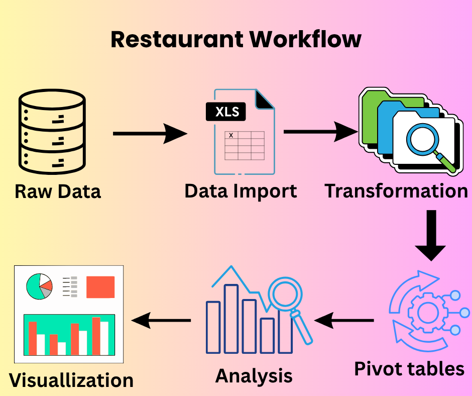

# RESTAURANT_ORDER_ANALYSIS
A simple analysis of restaurant orders to see when customers order the most and the least, looking at times, days, and months
# Restaurant Orders Analysis 🍽️

## 📌 Project Overview
This project analyzes restaurant order records from January to December.  
The dataset includes transaction dates and timestamps, with the aim of identifying patterns in customer ordering behavior across different months, days of the week, and times of the day.

## 📊 Dashboard Preview  

## 📊 Key Questions
- Which days of the week receive the most orders?  
- What times of day are most popular for orders?  
- Do ordering patterns differ across months?  
- Are there consistent peaks and drops throughout the year?  

## 🛠 Tools Used
- **Excel** → Data cleaning, analysis, and dashboard creation  
- **Pivot Tables & Charts** → Trend analysis by day and time  
- **Conditional Formatting** → Highlighting peaks and lows  

## 📈 Findings  

### January  
- Monday and Tuesday had the highest orders.  
- Saturday showed lower orders, while other days had no orders.  

### February  
- Friday, Thursday, and Wednesday had the most orders.  
- 2 PM was the peak order time.  

### April  
- Monday recorded the highest orders, followed by Sunday.  
- Saturday had the lowest orders, while other days had none.  
- 2 PM was the peak, orders slowed at 5 PM, rose again at 8 PM (but lower than 2 PM), then dropped.  

### July  
- Monday had the highest orders.  
- Saturday, Friday, and Thursday also showed strong sales.  
- 9 PM recorded the peak order time.  

### August  
- Thursday recorded the highest orders at 7 PM.  
- Lowest activity was at 9 PM, though orders rose again afterward.  

### December  
- Sunday had the highest orders, followed by Saturday, then Friday.  
- No other days recorded orders.  
- 2 PM was the busiest time, while 11 PM saw the lowest activity.  

### Overall (Jan–Dec)  
- **2 PM consistently had the highest orders across the year.**  
- After 2 PM, orders gradually dropped until late evening (around 11 PM).  
- Mondays, Thursdays, Fridays, and Sundays were among the strongest performing days.  

## 📊 Findings & Recommendations  

### Findings  
- Clear time-based pattern: **2 PM peak orders across most months.**  
- Evening orders decline after 9–11 PM.  
- Certain days dominate per month (e.g., Mondays in Jan & Apr, Thursdays in Aug, Sundays in Dec).  

### Recommendations  
- **Peak-hour strategy**: Focus staff and promotions around 2 PM daily.  
- **Evening boost**: Introduce deals after 8 PM to encourage late-night orders.  
- **Day-specific offers**: Run promotions on Mondays, Thursdays, Fridays, and Sundays since they show consistent demand.  

## 🚀 How to Use  
1. Download the Excel file from this repository.  
2. Open in Microsoft Excel.  
3. Explore the interactive dashboard to view monthly and overall trends.  
